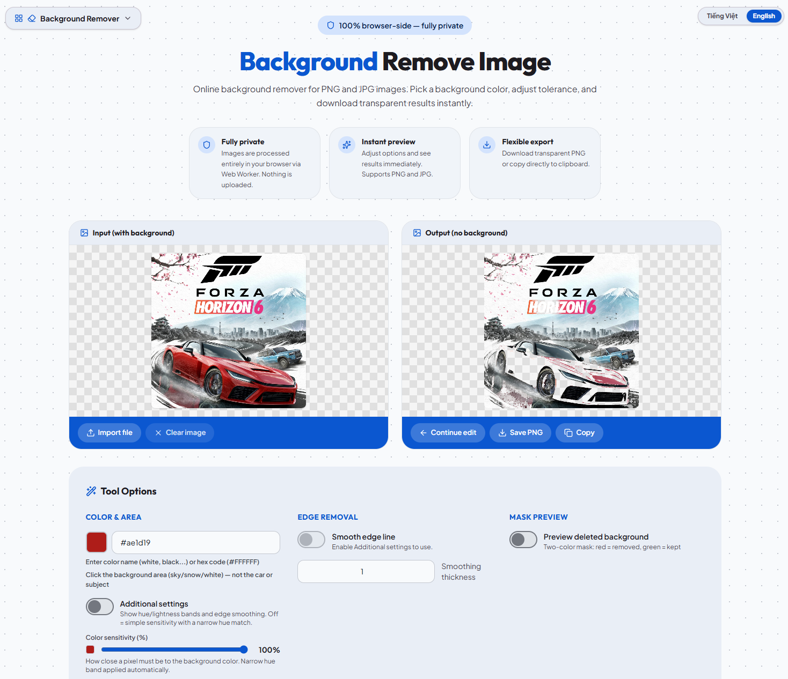

# Background Remover

A privacy-first, browser-based image toolkit for removing backgrounds and replacing colors. Everything runs locally in your browser via Web Workers — your images never leave your device.



## Live demo

Deploy your own copy with Vercel, or run locally (see below).

## Tools

| Tool | Description |
|------|-------------|
| **Background Remover** | Pick a background color, adjust sensitivity, export transparent PNG. Default mode uses fast RGB matching with a narrow hue band; enable **Additional settings** for full hue/lightness controls and edge smoothing. |
| **BG Remover (Classic)** | Original RGB distance algorithm with a simple tolerance slider — lightweight and predictable. |
| **Color Replacer** | Pick a source color on the image, choose a target color, and replace matching pixels while optionally preserving original tone. |

## Features

- **100% client-side** — processing happens in Web Workers; no server uploads
- **PNG & JPG** — drag-and-drop, file picker, or paste (Ctrl+V)
- **Eyedropper** — click the input image to pick background/source colors
- **Deferred processing** — no worker run until a color is chosen (less lag on load)
- **Live preview** — debounced updates while you adjust sliders
- **Export** — download transparent PNG or copy to clipboard
- **Continue editing** — use the output as the new input for another pass
- **Zoom preview** — click the result canvas for fullscreen pan/zoom
- **English & Vietnamese** UI

## Tech stack

- [React 19](https://react.dev/) + [Vite 8](https://vite.dev/)
- [Tailwind CSS v4](https://tailwindcss.com/)
- Web Workers for image processing
- Perceptual HSL matching for advanced color tools

## Getting started

### Prerequisites

- Node.js 20+

### Install & run

```bash
git clone https://github.com/dangphuc2470/background-remover.git
cd background-remover
npm install
npm run dev
```

Open [http://localhost:5173](http://localhost:5173).

### Build

```bash
npm run build
npm run preview
```

## Usage (Background Remover)

1. Load an image (drop, paste, or import).
2. **Click the background** on the input image to pick the color to remove.
3. Adjust **Color sensitivity** if needed.
4. Optional: enable **Additional settings** for hue/lightness bands and edge smoothing.
5. **Save PNG** or **Copy** the result.

## Deploy to Vercel

[](https://vercel.com/new/clone?repository-url=https%3A%2F%2Fgithub.com%2Fdangphuc2470%2Fbackground-remover)

Or connect the GitHub repo in the Vercel dashboard. Build settings:

| Setting | Value |
|---------|--------|
| Framework | Vite |
| Build command | `npm run build` |
| Output directory | `dist` |

GitHub Actions workflow (`.github/workflows/vercel-deploy.yml`) is included for CI deploy — add `VERCEL_TOKEN`, `VERCEL_ORG_ID`, and `VERCEL_PROJECT_ID` as repository secrets.

## Project structure

```
src/
  tools/           # BackgroundRemover, BackgroundRemoverOld, ColorReplacer
  workers/         # Web Worker entry points
  utils/           # Color math & canvas helpers
  components/      # Shared UI
  hooks/           # Worker lifecycle, debounced processing
```

## License

Private project — all rights reserved.
